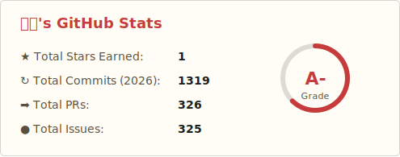

<!-- Typing header -->

  
   
  

<!-- About -->

### 👋 About

임베디드와 웹 등등 직접 만드는 걸 좋아하는 개발자입니다. Arduino · Raspberry Pi와 React · Flask를 자주 사용합니다.

- 🔧 임베디드/하드웨어 · 웹 풀스택에 관심이 많습니다.
- 🌱 Python · Java · C++ 를 주로 쓰고, 새로운 스택도 꾸준히 익히는 중입니다.
- 🔗 Portfolio: [pachir1su.github.io](https://pachir1su.github.io)

<!-- Tech stack -->

### 🧰 Tech Stack

  
  
  
  
  
  
  
  
  
  

<!-- GitHub Stats with Rank -->

  

  

<!-- Streak -->

  

<!-- Activity Graph -->

  

<!-- Snake -->

  

<!-- Ranker & links -->

  
  &nbsp;
  
  

