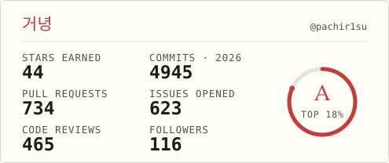

<!-- Header banner -->

  

<!-- Typing header -->

  
   
  

<!-- About -->

### About

<!-- Tech stack -->

### Tech Stack

<table>
  <tr>
    <td align="center"><b>Languages</b></td>
    <td>
      
      
      
      
      
      
    </td>
  </tr>
  <tr>
    <td align="center"><b>Web &amp; App</b></td>
    <td>
      
      
      
      
      
    </td>
  </tr>
  <tr>
    <td align="center"><b>Embedded</b></td>
    <td>
      
      
      
    </td>
  </tr>
  <tr>
    <td align="center"><b>Tools</b></td>
    <td>
      
      
      
    </td>
  </tr>
</table>

<!-- Projects -->

<!-- 

<b>공개 저장소</b>

 
<table>
  <tr><th align="left">Repository</th><th align="left">Language</th></tr>
  <tr><td><a href="https://github.com/pachir1su/pachir1su.github.io">pachir1su.github.io</a></td><td>HTML</td></tr>
  <tr><td><a href="https://github.com/pachir1su/2026_U-CAST">2026_U-CAST</a></td><td>C++</td></tr>
  <tr><td><a href="https://github.com/pachir1su/raspi-mc-server">raspi-mc-server</a></td><td>Python</td></tr>
  <tr><td><a href="https://github.com/pachir1su/computingSAGO">computingSAGO</a></td><td>Python</td></tr>
  <tr><td><a href="https://github.com/pachir1su/MultiMind">MultiMind</a></td><td>Python</td></tr>
  <tr><td><a href="https://github.com/pachir1su/media_swordmaster">media_swordmaster</a></td><td>Python</td></tr>
  <tr><td><a href="https://github.com/pachir1su/github-rank-insight">github-rank-insight</a></td><td>JavaScript</td></tr>
  <tr><td><a href="https://github.com/pachir1su/file_swordmaster">file_swordmaster</a></td><td>Jupyter Notebook</td></tr>
</table>

 -->

<!-- Stats -->

### Stats

<!-- GitHub Stats with Rank -->

  

  

<!-- Streak -->

  

<!-- Activity Graph -->

  

<!-- Snake -->

  

<!-- Footer banner -->

  

